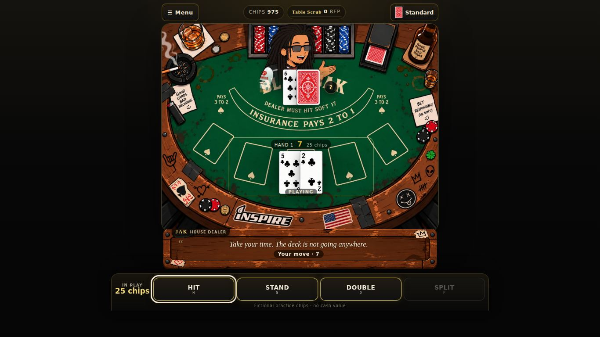
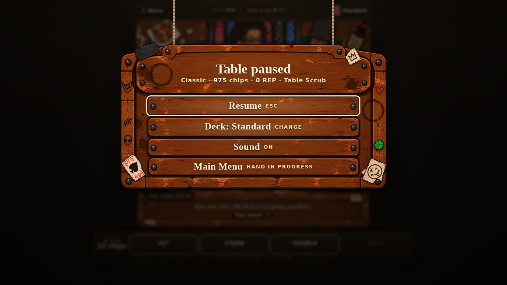
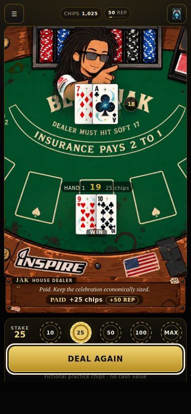
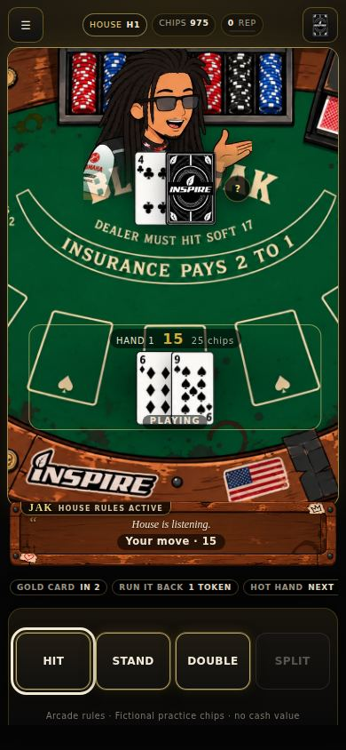

# BLACKJAK

**House Rules. Bad Decisions. One More Hand.**

BlackJak is a mobile-first blackjack game from OFFICIAL INSPIRE, inspired in personality by Jak Gold. The project keeps recognizable blackjack at its core and builds around it with a black-and-gold table aesthetic, reactive dealer commentary, fictional REP progression, achievements, and an optional arcade-style **Jak's House** ruleset.

## Current status

**BlackJak v0.4.0** gives Jak his full voice (cardistry, First Amendment-auditor bits, "Hallelujah"), cardistry card motion, and per-action haptics including iPhone. **v0.3.x** (v0.3.1: working music volume on iOS, separate music/effects sliders, a deck switch on every screen, polished buttons) adds the INSPIRE startup intro, menu/gameplay music with crossfades, event-driven table SFX, phone-to-desktop layout hardening, and a PWA that precaches the game but runtime-caches its large media. v0.2.1 added security hardening: a production CSP, escaped runtime text, patched tooling and lockfile-based CI. v0.1.0 delivered the full game: Classic play, Jak's House, local progression, Daily Hand, audio/haptics, accessibility, offline PWA and CI. v0.2.0 dresses it in the illustrated art set:

- the **illustrated table** (`blackjak-table.png`) as a shared, responsive game scene for Classic and Jak's House
- **Jak as a reactive dealer NPC**, with 19 sprite poses driven by dialogue events plus deal, draw and chip gestures
- **three sprite card decks**: Standard, Jak's Cosmic and Inspire Mono, chosen in Settings, the HUD or the pause menu
- a **wooden dialogue/status bar** for Jak's lines, the game status, results and REP
- a **graphical main menu and in-game pause board** built from `menu-bar.png`
- a game-first table shell: compact HUD, sticky action dock, immediate Deal again, and restrained game feel
- optimized WebP runtime art (2.9MB, down from 13.8MB), fully precached for offline play

| Desktop table | Pause board | Mobile (Jak's Cosmic deck) | Jak's House (Inspire Mono) |
|---|---|---|---|
|  |  |  |  |

More in [`docs/screenshots/`](docs/screenshots/). Blackjack rules and odds are unchanged from v0.1.0.

Core game features:

- Vite + TypeScript foundation
- responsive mobile-first black/gold table UI
- standard 52-card blackjack rules engine
- injectable Fisher-Yates RNG for deterministic tests
- ace-aware hard/soft hand evaluation
- dealer stands on all 17s, including soft 17
- Hit / Stand / Double / Split
- v1 split policy: equal blackjack point values may split (for example K + 10)
- natural blackjack pays 3:2
- split 21 pays as a normal win
- fictional practice-chip bankroll starting at 1,000
- stake presets: 10 / 25 / 50 / 100 / MAX (MAX capped at 250)
- initial, Double, and Split stakes are validated against available chips
- zero-chip **Refill Practice Chips** recovery with no purchase or real-world value
- multiple split hands render independently with active-hand highlighting
- dealer hole card remains hidden until resolution
- repeat-hand flow without page refresh
- persistent chip balance and Classic stats in versioned local storage
- persistent hands / wins / losses / pushes / blackjacks
- original HTML/CSS card faces and backs
- premium charcoal-felt / black-lacquer / brass-gold private-table visual system
- redesigned title/menu, Stats panel, Settings shell, and zero-chip recovery presentation
- engraved-style BlackJak card backs and premium cream playing-card faces
- staggered card-deal motion with reduced-motion fallback
- dedicated BLACKJAK / win / loss / push / split-decision result presentation
- circular chip-style stake controls and polished action controls
- responsive presentation tuned for 320px, 360px, 390px, 430px, tablet, and desktop widths
- data-driven Jak dealer commentary with 90+ original short reactions across 23 gameplay contexts
- weighted dialogue selection with recent-line anti-repeat memory
- reactions for blackjacks, dealer blackjacks, wins/losses, pushes, risky hits, doubles, splits, streaks, busts, refills, and return visits
- Jak dealer NPC from the project's own illustrated sprite sheet; no photo likeness or cloned voice
- commentary stays non-blocking and updates as a subtitle/status layer during play
- persistent REP progression that never changes card odds or dealer behavior
- REP rewards for wins, natural BlackJak, successful doubles, split sweeps, five-card wins, and survived risky hits
- eight escalating titles from **Table Scrub** through **BlackJak**
- nine deterministic achievements: BLACKJAK, WHY WOULD YOU DO THAT?, SPLIT PERSONALITY, GOLDEN BOY, HOUSE MONEY, I CAN QUIT ANYTIME, AGAIN., JAKPOT, and ABSOLUTE BULLSHII
- persistent win/loss streak state and ten-hand blackjack history
- compact title/REP meter on the table plus full progression display on Stats
- non-blocking achievement unlock toasts
- backward-compatible profile hydration for saves created before Prompt 5
- separate **Jak's House** arcade mode with explicit "not standard blackjack" labeling
- generic House modifier framework isolated from Classic `startRound`
- **Gold Card:** every third paid House hand turns the player's first opening card into a visibly gold Ace that counts as 1 or 11
- **Run It Back:** House sessions start with one token; after a net-losing House round, spend it to redeal the same base stake from a fresh deck with no additional initial chip charge
- while the Run It Back token is empty, completing five House rounds earns another token
- Run It Back replays do not increment the paid House-hand counter, so Gold Card scheduling stays deterministic
- **Hot Hand:** consecutive all-winning House rounds add +25% REP per win after the first, capped at a 2× REP multiplier; losses, pushes, and mixed split results reset it
- live House modifier status cards, Gold Card presentation, Hot Hand bonus readout, and replay-token controls
- House outcomes reuse the same chips, stats, achievements, and dealer personality while modifier logic stays separate
- project-safe synthesized WebAudio cues for cards, chips, controls, wins, losses, blackjack, and achievements
- optional synthesized room ambience with browser-autoplay-safe first-interaction activation
- persistent master feedback, SFX, ambience, haptics, and volume preferences
- defensive Vibration API feedback that silently degrades on unsupported browsers
- expanded persistent stats: win rate, doubles attempted/won, splits, split sweeps, busts, longest streaks, peak chips, lifetime REP, risky 16+ hits, and five-card wins
- deterministic **Daily Hand** challenge generated from local calendar date + stable challenge version
- Daily Hand always generates a playable decision state rather than an auto-resolved opening natural
- one scored Daily completion per local date with a flat +75 REP award; refreshes cannot repeatedly farm the reward
- Daily Hand uses a virtual wager and does not alter practice chips or ordinary Classic/House win-loss stats
- local Daily completion streak plus Web Share API result sharing with clipboard fallback
- installable PWA manifest with dedicated 192×192 and 512×512 black/gold app icons
- production Vite base path pinned to `/BlackJak/` for GitHub Pages asset correctness
- generated versioned service worker that precaches the actual hashed production JS/CSS/app-shell files
- offline navigation fallback plus cached static asset delivery after first successful PWA install/load
- content-hashed cache names and automatic removal of obsolete BlackJak caches
- safe update flow: new service workers wait until the player explicitly accepts the in-app update prompt
- install prompt, offline-mode status, and update-available UI
- GitHub Pages Actions workflow that installs dependencies, tests, typechecks, builds the PWA, uploads `dist/`, and deploys Pages
- accessible focus states, semantic controls, live result feedback, and 44px+ touch targets
- stable keyboard focus restoration across full-screen rerenders and mode changes
- keyboard shortcuts: **H** Hit, **S** Stand, **D** Double, **P** Split, **N** new/deal hand, **Esc** back to menu
- screen-reader card objects with rank/suit names while visible suit symbols preserve non-color distinction
- consolidated game-state live regions to avoid dealer/result/status announcement spam
- stale-control guards that ignore detached buttons after rapid double taps/rerenders
- unresolved Classic/House stakes stay in memory until resolution, so refresh/abandon does not permanently consume an unfinished wager
- House modifier/session state rolls back when an unresolved House hand is abandoned
- 320px/mobile text-overflow hardening, compact split-hand containment, safe-area/landscape fallbacks, and touch-action tuning
- corrupted/malformed local-storage envelopes safely fall back instead of leaking invalid state
- GitHub Actions now separates build health from Pages availability so a disabled Pages site does not turn a valid build into a failed workflow
- Vitest coverage for deck, hands, rules, round state, storage corruption/fallback, accessible card markup, and session economy

## Development Roadmap

See **[BlackJak-Development-Prompts.md](./BlackJak-Development-Prompts.md)**.

Prompts 0–11 delivered the v0.1.0 game. The visual-development phase (atlas, scene, Jak NPC, sprite decks, dialogue bar, menu board, shell, game feel and QA) is v0.2.0.

## Controls

Touch/click controls are always available. Keyboard users can Tab / Shift+Tab through the interface and use these shortcuts when a table action is available:

- **H** — Hit
- **S** — Stand
- **D** — Double
- **P** — Split
- **N** — Deal / Deal Again / start the Daily Hand when available
- **Esc** — return to the menu

## Local progression and saves

BlackJak stores chips, REP, achievements, stats, Daily Hand completion, and feedback settings locally in the browser. There is no account or backend requirement. Clearing browser/site data removes that local progress.

REP is a progression score only. It never changes deck order, odds, dealer behavior, or Classic blackjack payouts.

## Install / PWA

On a supported browser, load the production build once while online. When the browser exposes an install prompt, BlackJak can be installed as a standalone PWA. After the service worker has cached a successful production load, the app shell and local-first game state remain available offline.

The target production path is:

```text
https://officialinspire.github.io/BlackJak/
```

GitHub Pages must first be enabled once at **Settings → Pages → Build and deployment → GitHub Actions** for that URL to deploy.

## Local development

Requires **Node.js 22+**.

```bash
npm install
npm run dev
```

Then open the local URL printed by Vite.

### Validation

```bash
npm test
npm run typecheck
npm run build
npm run release:check
```

`npm run release:check` is the release gate and runs the complete test suite, explicit TypeScript validation, and the production PWA build.

## Project structure

```text
src/
  assets/      Vite `?url` imports for the PNG art sheets (fingerprinted + precached)
  config/      App constants and release/game configuration
  data/        Dealer dialogue, progression, House modifiers, and the visual atlas
  feedback/    Synthesized audio and haptic feedback
  game/        Pure rules, round/session state, House mode, progression, and Daily Hand
  pwa/         Install/update/network-status registration behavior
  storage/     Versioned local persistence and safe hydration
  styles/      Core, premium, mode-specific, PWA, and QA responsive styles
  types/       App/profile/preference types
  ui/          Card markup and DOM rendering/event flow
tests/         Vitest engine, persistence, accessibility-markup, and release-smoke suites
public/        Manifest, install icons, and Pages static files
scripts/       Post-build service-worker generation; dev-only atlas measurement script
.github/       CI and conditional GitHub Pages deployment workflow
```

The repository intentionally has no runtime framework dependency beyond browser APIs; Vite, TypeScript, and Vitest are development dependencies.

## Classic BlackJak v1 rules contract

- one standard 52-card deck per round for the current demo engine
- dealer hits 16 and below
- dealer stands on hard and soft 17+
- blackjack = initial two-card 21
- natural blackjack pays 3:2
- normal win pays 1:1
- push returns the wager
- Double Down is available only on the first two cards and requires bankroll for the additional stake
- Split is available only on the first two cards, when both cards have equal blackjack point value, and requires bankroll for the second stake
- no insurance
- no surrender
- no side bets


## Jak's House rules

**Jak's House is an arcade mode, not standard blackjack.** Classic BlackJak remains available separately and does not use these modifiers.

### Gold Card

Every third **paid** House hand changes the player's first opening card into a Gold Card. The card is rendered in gold and counts exactly like an Ace: **1 or 11**, whichever standard Ace value best fits the hand. A Run It Back replay keeps the same House hand number, so if the original hand was a Gold Card hand, its replay is too.

### Run It Back

A House session begins with **one token**. After a House round with negative net chip result, the token can be spent to redeal the **same base stake** using a fresh shuffled deck. No new initial stake is charged, but optional Double/Split actions still require their normal additional fictional-chip stake. The original result remains in local stats/history; the replay is another resolved hand. While no token is held, completing five House rounds awards one replacement token.

### Hot Hand

Hot Hand changes **REP rewards only**, never deck order, card values, payouts, or dealer behavior.

- first consecutive all-winning House round: 1× REP
- second: 1.25×
- third: 1.5×
- fourth: 1.75×
- fifth and beyond: 2× cap

A loss, push, or mixed split result resets the House Hot Hand streak.


## Startup, music, audio, haptics, and game feel

**Startup.** The app opens on an INSPIRE lockup: *Tap / click / press Enter to start*. That first gesture unlocks audio, then the INSPIRE intro video plays (Skip, Enter or Esc skips it). The game starts when the video ends, is skipped, fails to load or play, or stalls for 8 seconds, so missing, blocked or offline media never strands the player. Returning to a background tab resumes a paused intro.

**Music.** `src/audio/music.ts` plays *Jak Gold's Table* on the menu, Stats and Settings, and *Minimal Gameplay Background* at the tables and Daily Hand, with a 700ms crossfade. Exactly one track is audible at a time: re-renders never restart a fade, rapid navigation cancels stale fades, the intro's audio stops before the menu music starts, and all music pauses in a background tab and resumes on return. Tracks don't download until the start gesture. Playback errors are swallowed, so music can never block navigation.

**SFX.** The Web Audio API synthesizes original cues at runtime (no sound packs): shuffle, chip, deal, hit/stand/double/split, card flip, win/loss/blackjack stings and achievements. Each gameplay event plays once, even when it causes several renders.

Settings persist locally, and missing or corrupt values fall back to defaults:

- Master feedback (music, SFX and haptics)
- Music
- SFX
- Haptics
- Music volume and Effects volume (separate sliders)

Music is routed through a Web Audio gain node, so the music slider and crossfades work on iOS Safari too (it ignores `audio.volume`). Like the SFX, music follows the iPhone's silent switch.

**Jak's voice** (`src/data/dialogue.ts`): Jak is a dealer who is also a cardist (fans, springs, Sybil cuts, one-handed Charliers). He talks like a First Amendment auditor filming the table ("This is a public forum", "I do not answer questions", "Am I being detained?", "get me a supervisor") and shouts "Hallelujah" when the chips come in. He speaks as he deals (fanning the deck) and when you Stand, as well as on every result.

**Cardistry motion** (`src/styles/fx.css`), each move under half a second and one-shot:
- Deck fan: the deck thumb-fans open and squares up on every shuffle.
- Pitched deal: cards leave the deck spinning and land with a small overshoot.
- Twirl and spring: a Hit card twirls in as the top card springs off the deck.
- Sideways double: a Double card lands sideways first, the casino double-down mark.
- Blackjack fan: a natural fans open and snaps shut with a glow.

All of it is off with reduced motion.

**Haptics** (`HAPTIC_PATTERNS` in `src/feedback/feedback.ts`): every button tap, stake chip and toggle gives a tick, and each action has its own feel. Hit is a crisp tick, Stand a settled double-tap, Double a heavier press, and Split a "da-dum". Deal, win, loss, bust and blackjack have their own patterns too. Android uses `navigator.vibrate()`. iPhone Safari has no vibration API, so BlackJak toggles a hidden `<input switch>`, which plays the iOS system haptic on iOS 18+. Haptics never block gameplay and follow the Haptics setting. Reduced-motion behavior stays independent of audio/haptic settings.

## Daily Hand

The **Daily Hand** is a local deterministic challenge and requires no backend.

- Seed input: local `YYYY-MM-DD` date + `daily-v1` challenge version.
- Everyone using the same build/date receives the same starting player hand and dealer up-card.
- The generator skips opening states that auto-resolve so each Daily Hand contains an actual player decision.
- Reloading before resolution recreates the same challenge.
- The first resolved completion for a local date awards **+75 REP**.
- Further refreshes/replays that date cannot award more Daily REP.
- Daily uses a virtual 25-chip rules-engine wager for outcome math; it does **not** debit/credit the player's practice-chip bankroll.
- Daily results do not inflate ordinary Classic/House win/loss statistics.
- Completion streaks persist locally.
- Sharing uses Web Share API when available and clipboard copy as fallback; no personal information is included.


## PWA, offline support, and GitHub Pages

Prompt 9 makes BlackJak installable and offline-capable without adding a third-party PWA runtime dependency.

### Production URL and base path

The production build uses Vite base path:

```text
/BlackJak/
```

Target GitHub Pages URL:

```text
https://officialinspire.github.io/BlackJak/
```

This keeps generated JS, CSS, manifest, icon, and service-worker URLs inside the repository's Pages subpath.

### Offline strategy

`npm run build` now performs three steps:

1. TypeScript validation.
2. Vite production build.
3. `scripts/build-sw.mjs` scans the completed `dist/` tree and generates `dist/sw.js`.

Generating the service worker **after** Vite is important because Vite fingerprints production JS/CSS filenames. The generated worker precaches the real output filenames rather than guessing them.

The worker splits assets in two:

- **Core (precached on install):** HTML, JS, CSS, manifest, icons, the startup logo and all WebP art, about 3.2MB. Installing means the game is playable offline.
- **Media (runtime-cached):** the intro MP4 and both MP3s (about 5.7MB) are **not** in the install list, so a slow or failed media download can never break install or startup. They are cached in `blackjak-media-v1` the first time they play, and later answered from cache, including the HTTP `Range` requests that audio/video elements make (`206 Partial Content`; Safari requires it). Media filenames are content-hashed, so this cache survives app updates, and files a new build no longer ships are pruned on activate. Offline without cached media, the intro is skipped and music stays silent. The game itself is unaffected.

Vite emits URL-safe asset names (`jak-gold-s-table-<hash>.mp3` rather than `Jak Gold's Table-<hash>.mp3`), so no URL or cache key needs percent-encoding.

Each build creates a content-derived cache name. On activation, older BlackJak app caches are removed. Same-origin requests outside `/BlackJak/` are ignored.

After the first successful production load/service-worker install, the cached app shell includes the built application, manifest, icons, and hashed assets. Local progress remains in browser local storage, so Classic play, House play, chips, REP, achievements, settings, stats, and deterministic Daily Hand data remain local.

### Safe updates

A new service worker does **not** immediately replace an active worker during a running game. When a newer build finishes installing, BlackJak shows an update notice. Choosing **Update** sends `SKIP_WAITING` to the waiting worker and reloads only after it takes control.

This avoids mixing old HTML/JavaScript with a new cache in the middle of a hand.

### Installability

The manifest includes standalone display mode, BlackJak theme/background colors, and dedicated 192×192 / 512×512 PNG icons. Supporting browsers may expose BlackJak as an installable app; the UI also listens for `beforeinstallprompt` and surfaces an Install control when the browser provides that event.

### GitHub Pages deployment

`.github/workflows/pages.yml` runs CI on pull requests, pushes to `main`, and manual dispatch. It:

- installs dependencies with Node 22
- runs Vitest
- runs TypeScript typecheck
- builds the PWA and generated service worker
- verifies the expected production files exist
- checks whether this repository's GitHub Pages site is already enabled
- configures/uploads/deploys Pages only when Pages is available
- preserves a normal `dist/` artifact and finishes successfully when Pages has not yet been enabled

This prevents a repository-administration limitation from masking a healthy application build. The connected workflow token can deploy an existing Pages site, but it cannot create/enable Pages for the first time. If Pages is still disabled, use **Settings → Pages → Build and deployment → GitHub Actions** once; a later push or manual run will deploy automatically. The workflow uses `cancel-in-progress: false`, so rapid successive commits queue rather than cancelling one another.


## Accessibility, keyboard, and mobile QA

Prompt 10 is a hardening pass rather than a feature expansion.

### Keyboard controls

Normal Tab / Shift+Tab navigation works throughout the app. At an active table:

- **H** — Hit
- **S** — Stand
- **D** — Double
- **P** — Split
- **N** — Deal / Deal Again / start the Daily Hand when that control is available
- **Esc** — return to the menu

Keyboard shortcuts are ignored while typing or adjusting form controls, and key-repeat is ignored to avoid accidental repeated actions.

### Focus and screen readers

Full-screen DOM rerenders preserve the focused control when an equivalent control still exists. On a real screen change, focus moves to the new main region instead of disappearing back to the browser body. Cards expose rank/suit names as playing-card objects, active player hands expose total/wager/state, and the current game-status line is the primary polite live region. Dealer commentary and the visual result banner remain readable without competing with that status announcement.

### Mobile and touch behavior

The responsive QA layer keeps controls at roughly 44px or larger, applies `touch-action: manipulation` to tap controls, ignores stale detached controls after rerenders, tightens split hands at 320–360px, prevents horizontal page overflow, wraps long commentary/control text, respects safe-area insets, and allows short landscape screens to scroll instead of compressing the table into overlapping content.

### Refresh and corrupted storage behavior

An unfinished Classic or House wager is held in memory and committed only when the round resolves. Refreshing or abandoning an unresolved hand therefore restores the last committed bankroll rather than charging for a round that no longer exists. Malformed JSON, wrong-version storage envelopes, missing values, and blocked browser storage all fall back safely.


## Game scene

Classic and Jak's House render through one shared scene component (`src/ui/scene.ts`), stacked bottom to top: the `blackjak-table.png` table, the Jak NPC placeholder, the cards, dialogue/status plus the round result, and then the HUD. Controls stay as ordinary DOM buttons directly below. Anchors are normalized to the table art and come from `src/config/scene-layout.ts` (derived from the measured `TABLE_LAYOUT`). They're emitted as CSS custom properties and consumed by `src/styles/scene.css`, so `render.ts` contains no coordinates.

The table keeps its native aspect ratio. The frame height follows the viewport: on portrait phones the frame is taller than the art, so the table is scaled to cover and its outer decor is cropped at the sides, never stretched. Card size tracks the frame through container query units, so cards stay at 48px or wider on 320px phones and top out at 96px on desktop. On short landscape screens the table sits on the left with the controls on the right. Jak's House only adds its existing modifier visuals (HUD pill, gold rim, gold cards, the Run It Back panel, and the modifier strip below the controls).

### Jak, the dealer NPC

Jak comes from `blackjak-sprite-sheet.png` and stands behind the dealer's cards; the lower part of his viewport fades out behind them. `src/data/dealer-visuals.ts` maps every `DialogueEvent` to a `DealerMood` and each mood to one or more sprite poses. Examples: `player_blackjack` → surprised, `dealer_blackjack` → smug, `player_bust` → shrug, `double_loss` → teasing. Short one-shot gestures (deal → card flick, hit → card toss, double → chips) play before he settles into the dialogue pose. The mapping reads only dialogue events and UI action cues, never rules or round state. Each pose is framed on its measured sunglasses position, so his head stays the same size whether a bust, half-body or full-body sprite is showing. The sprite is `aria-hidden`; his lines stay as text in the dialogue layer. With reduced motion, gestures and idle breathing are turned off.

### Game-first table shell

Tables use a compact, fixed rhythm:

- **HUD:** ☰ Menu, chips, title with REP, and a deck button. The deck button cycles the card theme mid-hand; it's visual only, and the cards stay the same.
- **Center:** Jak, the illustrated table and the cards.
- **Below the table:** the wooden dialogue/status bar.
- **Dock** (`src/ui/table-dock.ts`): one fixed-height strip that changes by phase.
  - Betting: stake chips, then Deal.
  - Playing: Hit, Stand, Double, Split.
  - Resolved: Deal again, which gets focus so Enter or N redeals straight away, plus Run It Back in Jak's House when it's available.
  - Out of chips: a free practice refill.

Enabled buttons glow and disabled ones fade to grey. On phones the dock is sticky at the bottom. On desktop and tablet, Classic fits with no scrolling from 1280×720 up, and on phones from 320×568. Jak's House rules become one line of modifier pills with a collapsible rules note. Only newly dealt cards play the deal-in animation. Sound, haptics and shortcuts (N, H, S, D, P, Esc) are unchanged. Fictional practice chips only: no purchase, deposit, cash-out, crypto or operator UI, and a test enforces this.

### Game feel

Short, restrained cartoon effects, each 120–500ms (`FX_TIMING` in `src/ui/fx.ts`, emitted as `--fx-*` properties for `src/styles/fx.css`):

- New cards slide in from the shoe, and the dealer's hole card flips over when it's revealed.
- Stake chips bounce when chosen, and the pressed action button flashes.
- Blackjack gives the hand a gold pop, a win lifts the cards, and a bust gives a short knock with a red flash (no screen shake).
- The dialogue panel slides in when you sit down, and each new Jak line fades in. Jak reacts with a quick squash-and-settle and plays his deal, draw and chips gestures.
- Achievements pop in.

Effects are one-shot cues consumed by the next render, so an ordinary re-render (choosing a stake, say) never replays a bust shake or a dialogue fade. Game state always updates first, and nothing waits on an animation. Sound and haptics are the existing WebAudio and vibration cues. With reduced motion, every effect is off.

A pointer tap that lands within 260ms of the dock changing shape is ignored, so a double-tap on Stand can't hit the Deal again that appears in its place, and a double-tap on Deal can't hit Hit. Keyboard input is never guarded, and repeated taps on the same control (Hit, Hit) are never delayed.

### Main menu and pause board

The main menu and the in-game pause board are both `menu-bar.png`, used as a wooden sign. Real `<button>`s sit over the header plaque and the four planks at hit areas normalized to the art (`src/config/menu-board-layout.ts`). Each hit area covers its whole row band, gap to gap, so rows never overlap. On phones the planks fill the width and the outer posts crop at the screen edges, leaving rows 26px or taller at 320px (WCAG 2.5.8) with no stretching. Tablets and desktop show the whole board. Main menu: Classic BlackJak (the plaque), Jak's House, Daily Hand, Stats, Settings.

At a table, **☰ Menu** or **Esc** hangs the pause sign over the dimmed table. Opening it doesn't re-render or reset anything: the table stays mounted but inert, gameplay shortcuts are ignored, and the round and chips are untouched. Options: Resume (or Esc again), Deck (cycles the card theme), Sound on/off, and Main Menu. Main Menu asks for a second press while a hand is in play; leaving abandons the hand, and no chips are charged. Settings is offered inline rather than by navigating away, because the Settings screen would end the hand. `?debugVisuals=1` outlines every hit area.

### Dialogue / status panel

Jak's lines, the gameplay status, round results and REP notes share one `DialogueStatusPanel` (`src/ui/dialogue-panel.ts`) framed by `dialogue-status-bar.png`. It sits in a bar under the table, tucked over the bottom rail, so the felt stays clear for cards. The frame is a nine-slice (CSS `border-image`): cut lines come from the measured text-panel region, so rivets and stickers stay undistorted and the edges stretch only along the plank grain. The recessed center is cover-cropped from the same sheet rather than squashed. A `clip-path` hides the image's black matte and the stray marks along its top edge. All geometry comes from `src/config/dialogue-panel-layout.ts` as custom properties.

All text is semantic HTML over the art: speaker tab, commentary line, and one compact status/result line. That status line is the only live region, so a result such as "PAID +25 chips +50 REP" is announced once; Jak's commentary is visible but not live, as before. The panel has no focusable parts and never waits, so play is never paused. With reduced motion, the line fade is off; with forced colors, the art is dropped for a plain border.

### Runtime art and offline

The seven original PNG sheets at the repository root stay the untouched source art. `scripts/optimize-assets.py` builds optimized WebP copies in `src/assets/runtime/`:

- The pixel dimensions are identical, so every atlas coordinate still applies.
- Colour is quality 92, or 95 for the card sheets because of their small corner indices. Alpha is lossless.
- On the dealer sheet, pixels from neighbouring poses that overlap inside each pose's rect are cleared, so no pose shows slivers of another.

Weight falls from 13.8MB to 2.9MB. A manifest records each source PNG's SHA-256, and `tests/runtime-assets.test.ts` fails if a PNG changes without the WebP being regenerated.

`npm run build` ends with `scripts/verify-dist.mjs`, which fails the build if:

- the Content-Security-Policy meta tag is missing, or an inline script appears

- any core file in dist is missing from the service-worker precache, a media file *is* precached, or any referenced asset is missing
- the startup logo, intro video or either music track is missing, truncated, unreferenced by the app, or not routed through the runtime media cache
- a dist filename isn't URL-safe, or the CSP doesn't allow same-origin media (`media-src 'self'`)
- media weight goes over budget (7MB total, 3.2MB per file)
- any of the seven sheets isn't present as WebP
- a raw source PNG is shipped
- image weight goes over budget (4.5MB total, 900KB per image)

Browser QA scripts for layout, keyboard, reduced motion, mute, refresh, corrupt storage, offline and PWA update are in `scripts/qa/`.

### Card decks

Cards are drawn from the three deck sheets through a strict `Card {rank, suit}` → sprite mapping in `src/data/card-atlas.ts` (52 faces plus a back per deck). Every face was checked by eye: the corner index (rank and suit) matches its key in all three sheets, and pip counts were counted on every number card. The Inspire deck orders its rows ♠ ♥ ♣ ♦ and prints all suits in black.

**Flagged art:** the Inspire 7♠, 7♥ and 7♣ show six pips (their index correctly reads 7). They are listed in `CARD_ART_ISSUES` and render as the drawn CSS face instead of the misleading sprite. The `?debugVisuals=1` inspector marks them in red. All other cells map directly.

Sprites sit undistorted inside the existing card box, so sizing, overlap, split hands and the deal animation are unchanged. The hidden dealer card shows the deck's own back. Jak's House Gold Card adds a gold tint, ring and "GOLD" tag on top of the themed card; the rule itself is untouched. Accessible names ("K of hearts", "Hidden dealer card", "Gold Card, counts as Ace, …") are unchanged.

Settings → **Card deck** chooses Standard (default), Jak's Cosmic or Inspire Mono. The choice is stored separately under `visual-preferences`, so existing saves load unchanged, and a missing or unknown value falls back to Standard.

## Visual atlas (art sheets)

The PNG sheets at the repository root (`blackjak-sprite-sheet.png`, `blackjak-table.png`, `dialogue-status-bar.png`, `menu-bar.png`, and the three `blackjak-cards-*.png` decks) are mapped in `src/data/visual-atlas.ts`. Every `SpriteRect` was measured from the actual pixels rather than an assumed grid — ace/court cards are wider, rows sit at different offsets, the Inspire deck orders its rows ♠ ♥ ♣ ♦, and neighbouring dealer poses overlap (their shared borders sit on min-cost cut lines so rects never intersect). `scripts/measure-visual-atlas.py` reproduces the measurements.

`src/ui/atlas.ts` renders any rect via SVG `viewBox` cropping. Gameplay UI does not use the atlas yet; open `?debugVisuals=1` (e.g. `/BlackJak/?debugVisuals=1`) to load the lazy visual-atlas inspector, which overlays every rect on its sheet and previews each crop. `tests/visual-atlas.test.ts` checks sheet dimensions against the PNG headers plus bounds, duplicates, and overlaps.

## Current limitations

- **Single-player/local-first demo:** no multiplayer, backend account system, cloud save, or global leaderboard.
- **Browser-local persistence:** clearing site data removes chips, REP, stats, achievements, Daily completion, and settings.
- **Classic v1 scope:** no insurance, surrender, side bets, or real-money functionality.
- **Art notes:** the Inspire deck's 7♠, 7♥ and 7♣ are misdrawn in the source sheet (six pips); they render as a drawn fallback face until the art is corrected. Jak's shuffling pose isn't used by any mood yet.
- **Media caching:** the core PWA is precached; the intro video and two music tracks are runtime-cached after first play, so installs/updates never block on ~5.7MB of media. If media is unavailable, the intro is skipped and gameplay still starts.
- **Intro codec:** the intro is H.264 MP4. Chromium builds without proprietary codecs (such as Playwright's) can't play it, and skip straight to the menu.
- **Automated browser E2E:** CI now runs Chromium device/integration QA across startup, menu, Classic, Jak's House, Daily, responsive layouts, input stress, refresh recovery, PWA update, reduced motion, mute, and offline core play.

## Roadmap after v0.2.0

Potential later work includes corrected Inspire sevens, a Daily Hand screen on the illustrated scene, voice assets, additional dealer rooms, cosmetic card/chip themes, expanded House modifiers, richer Daily analytics, multiplayer/pass-and-play experiments, cloud saves, leaderboards, seasonal events, and deeper achievement content.

See **[BlackJak-Development-Prompts.md](./BlackJak-Development-Prompts.md)** for the original staged development roadmap and **[CHANGELOG.md](./CHANGELOG.md)** for release history.

## Release validation

The release pass reviews package scripts/dependencies, PWA configuration, deployment behavior, TODO/scaffold residue, repository assets, TypeScript diagnostics, test output, and production-build output.

A dedicated release-smoke suite covers:
- fresh profile/default bankroll and zero-chip refill
- natural blackjack settlement, REP, stats, and achievement unlock
- bust, Double, and Split resolution paths
- profile/progression and feedback-settings persistence
- Jak's House isolation and Gold Card scheduling
- deterministic Daily Hand and one-award-per-date behavior

GitHub Actions remains the source of truth for the final build gate and now includes the Chromium browser QA suites in addition to Vitest, TypeScript, production build, artifact validation, and Pages deployment.

## Practice-chip economy

BlackJak is an entertainment game using **fictional practice chips and REP only**. Practice chips cannot be purchased or exchanged for money or prizes. If the local practice-chip balance reaches zero, the game provides a free refill to the baseline stack.

## Design principle

> **Don't reinvent blackjack. Reinvent the feeling of sitting at the table.**

## Credits

- **Design, development, and publishing:** OFFICIAL INSPIRE
- **Jak Gold collaboration credit:** *Placeholder — replace with approved collaboration / likeness / voice credit before any build using those assets.*
- The v0.2.0 build uses the project's illustrated art sheets (table, Jak sprites, card decks, dialogue bar, menu board), browser-synthesized audio, and no photo likeness or cloned voice.

## OFFICIAL INSPIRE

https://www.inspireclothing.art/
